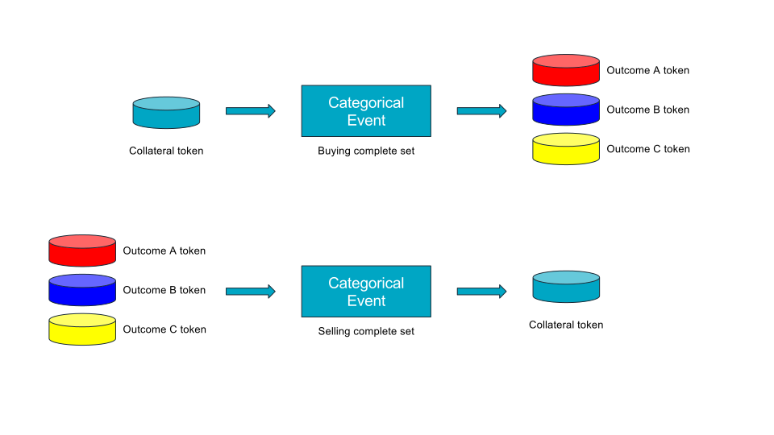
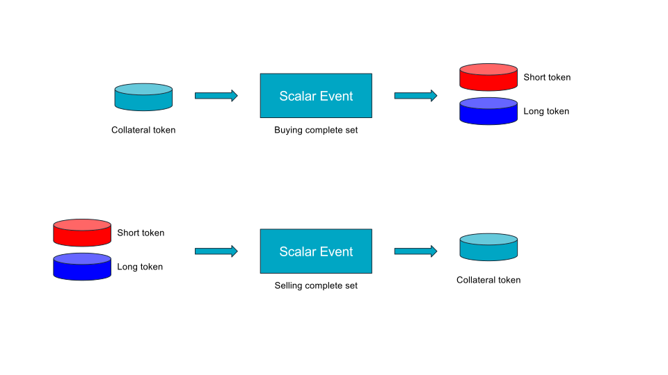

Gnosis Smart Contracts Documentation
====================================

Introduction
------------

Events
------
### Abstract event
#### Event(Token _collateralToken, Oracle _oracle, uint8 outcomeCount)
#### buyAllOutcomes(uint collateralTokenCount)
#### sellAllOutcomes(uint outcomeTokenCount)
#### setWinningOutcome()
#### redeemWinnings() returns (uint)
#### getOutcomeCount() returns (uint8)
#### getOutcomeTokens() returns (OutcomeToken[])
#### getOutcomeTokenDistribution(address owner) returns (uint[] outcomeTokenDistribution)
#### getEventHash() returns (bytes32)

### Categorical event

#### CategoricalEvent(Token _collateralToken, Oracle _oracle, uint8 outcomeCount)

### Scalar event

#### ScalarEvent(Token _collateralToken, Oracle _oracle, int _lowerBound, int _upperBound)

Oracles
-------

### Abstract oracle
#### isOutcomeSet() returns (bool)
#### getOutcome() returns (int)

### Centralized oracle
#### CentralizedOracle(address _owner, bytes32 _descriptionHash)
#### replaceOwner(address _owner)
#### setOutcome(int _outcome)

### Difficulty oracle
#### DifficultyOracle(uint _blockNumber)
#### setOutcome()

### Majority oracle
#### MajorityOracle(Oracle[] _oracles)
#### getStatusAndOutcome() returns (bool outcomeSet, int outcome)

### Signed message oracle
#### SignedMessageOracle(bytes32 _descriptionHash, uint8 v, bytes32 r, bytes32 s)
#### replaceSigner(address _signer, uint _nonce, uint8 v, bytes32 r, bytes32 s)
#### setOutcome(int _outcome, uint8 v, bytes32 r, bytes32 s)

### Ultimate oracle

#### UltimateOracle(Oracle _oracle, Token _collateralToken, uint8 _spreadMultiplier, uint _challengePeriod, uint _challengeAmount, uint _frontRunnerPeriod)
#### setOutcome()
#### challengeOutcome(int _outcome)
#### voteForOutcome(int _outcome, uint amount)
#### withdraw() returns (uint amount)
#### isChallengePeriodOver()
#### isFrontRunnerPeriodOver()
#### isChallenged()

Markets
-------
### Abstract market
#### fund(uint _funding)
#### close()
#### withdrawFees()
#### buy(uint8 outcomeTokenIndex, uint outcomeTokenCount, uint maxCosts) returns (uint)
#### sell(uint8 outcomeTokenIndex, uint outcomeTokenCount, uint minProfits) returns (uint)
#### shortSell(uint8 outcomeTokenIndex, uint outcomeTokenCount, uint minProfits) returns (uint)
#### calcMarketFee(uint outcomeTokenCosts) returns (uint)

### Default market
#### DefaultMarket(address _creator, Event _eventContract, MarketMaker _marketMaker, uint _fee)

### Abstract market maker
#### calcCost(Market market, uint8 outcomeTokenIndex, uint outcomeTokenCount) returns (uint)
#### calcProfit(Market market, uint8 outcomeTokenIndex, uint outcomeTokenCount) returns (uint)

### LMSR market maker
