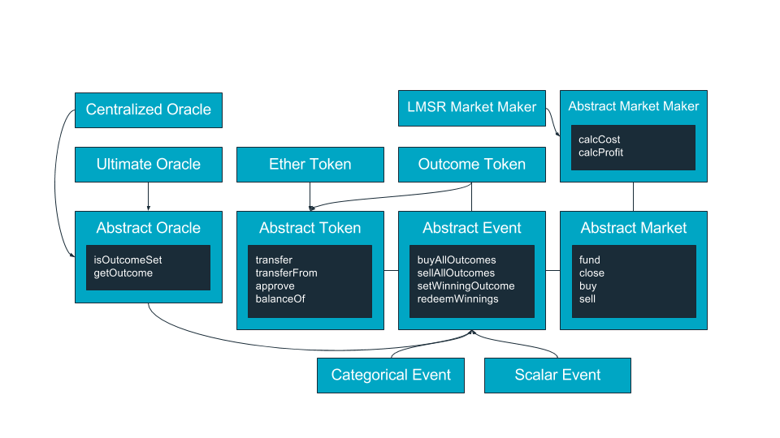
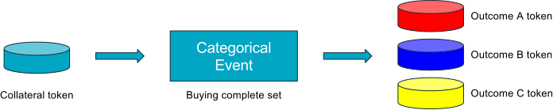
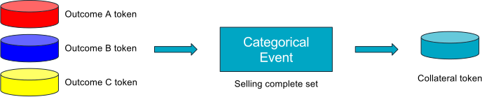
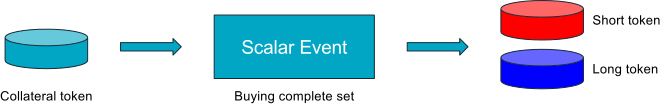
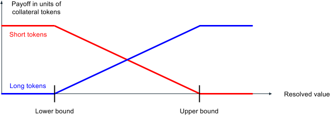
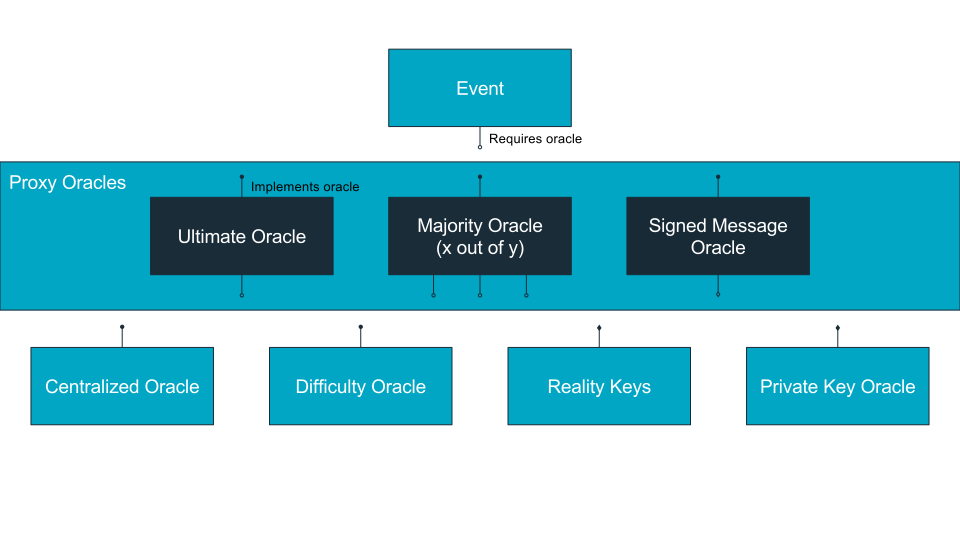
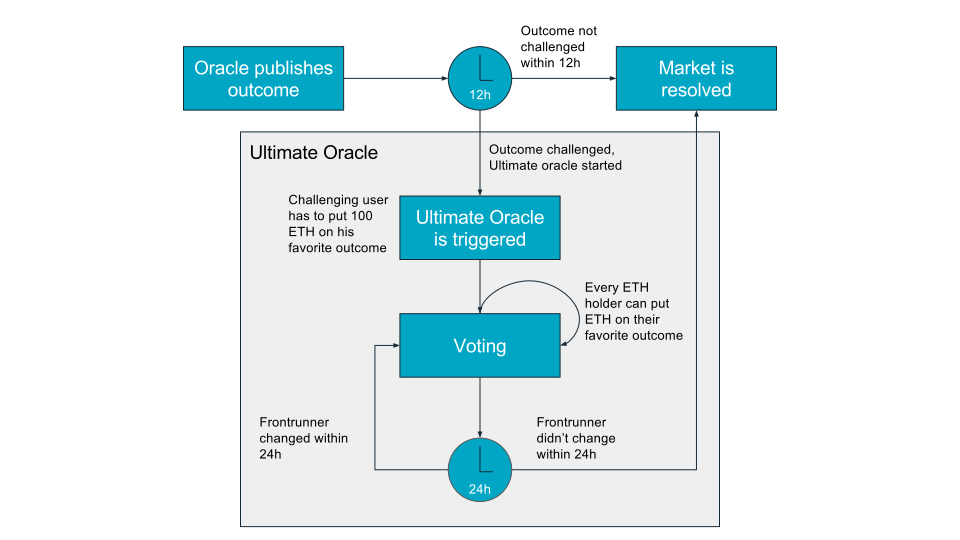

Gnosis Smart Contracts Documentation
====================================

Introduction
------------
The Gnosis smart contract design follows a modular contract structure making it easy to split functionalities to upgrade or reuse parts. The current Gnosis implementation consists of over 25 smart contracts ranging from different oracle solutions to market makers. All of them have been written in Solidity.

For every prediction market two main objects have to be created:
1. An event object referencing an oracle to resolve the event and a collateral token to exchange outcome tokens for collateral tokens.
2. A market object, which connects a market maker with the event.

Once the event occurred, the event can be resolved and winnings can be redeemed.

Events
------
### Abstract event
The abstract event contract contains all contract functionality shared between scalar and categorical events.

#### Event(Token _collateralToken, Oracle _oracle, uint8 outcomeCount)
On a event creation a collateral token, an oracle and an outcome count have to be defined. The collateral token is used to deposit a collateral in return for outcome tokens. A common collateral token is Ether itself. The oracle is used to define which outcome was resolved as the winning outcome. The outcome count defines the number of outcome tokens. One outcome token is created for each outcome when the event is created.

#### buyAllOutcomes(uint collateralTokenCount)
`buyAllOutcomes` allows to buy multiple sets of outcome tokens in exchange for multiple (`collateralTokenCount`) collateral tokens. Assuming an event has two outcomes and the buyer invests 10 collateral tokens, he will receive 10 outcome tokens for each outcome.

#### sellAllOutcomes(uint outcomeTokenCount)
`sellAllOutcomes` allows to sell multiple (`outcomeTokenCount`) sets of outcome tokens in exchange for multiple collateral tokens. Assuming an event has two outcomes and the buyer sells 2 sets of outcome tokens (2 outcome tokens for each outcome), he will receive 2 collateral tokens.

#### setWinningOutcome()
`setWinningOutcome` sets the winning outcome in the event contract if the defined oracle contract set a winning outcome.

#### redeemWinnings() returns (uint)
Abstract function implemented in the inheriting event contract.

#### getOutcomeCount() returns (uint8)
Returns the number of event outcomes.

#### getOutcomeTokens() returns (OutcomeToken[])
Returns the addresses of all event outcome tokens.

#### getOutcomeTokenDistribution(address owner) returns (uint[] outcomeTokenDistribution)
Returns an array of outcome tokens balances for an `owner`.

#### getEventHash() returns (bytes32)
Abstract function implemented in the inheriting event contract.

### Categorical event
Categorical events define a set of outcomes and resolve to one outcome out of this set of outcomes. An example for such an event is an election where the set of outcomes is defined as the set of candidates participating in the election:

Event: Who becomes the next president of the United States?

Outcomes: Donald Trump, Hilary Clinton.

The set of outcomes has to cover all possible outcomes. The probability of all outcomes has to add up to 100%.

Using the `buyAllOutcomes` function a buyer can invest collateral tokens in return for a set of outcome tokens:

Using the `sellAllOutcomes` function a seller can sell a set of outcome tokens for collateral tokens:

After the oracle decided the winning outcome, one winning outcome token can be redeemed for one collateral token. All other outcome tokens are worthless.

#### CategoricalEvent(Token _collateralToken, Oracle _oracle, uint8 outcomeCount)
An categorical event has the same properties as the abstract event contract. Only one event for each combination of properties (collateral token, oracle, outcome count) can be created. This allows to combine liquidity for each currency and outcome in only one event. Several markets can use the same event to share this liquidity pool.

#### redeemWinnings() returns (uint)
Redeem winnings allows the sender to redeem winning outcome tokens for collateral tokens. The function revokes all sender's outcome tokens of the winning outcome and sends the same amount in collateral tokens back to the sender. The function returns this amount.

#### getEventHash() returns (bytes32)
This function generates a unique event hash based on the event properties: collateral token, oracle and outcome count.

### Scalar event
Scalar events are used to predict a number within a defined range. An example for such an event is the prediction of a future price:

Event: What will be the Apple Inc. stock price per share be at the end of 2017?

Range: $300 - $1000

For every scalar event two outcome tokens are created. One outcome token for long positions and one for short positions.

Using the `buyAllOutcomes` function a buyer can invest collateral tokens in return for long and short outcome tokens:

Using the `sellAllOutcomes` function a seller can sell sets of long and one short outcome tokens for collateral tokens:

#### ScalarEvent(Token _collateralToken, Oracle _oracle, int _lowerBound, int _upperBound)
A scalar event has the same properties as the abstract event contract and extends the model with a lower and an upper bound. Scalar events have always only 2 outcome tokens for long and short positions. Only one event for each combination of properties (collateral token, oracle, lower bound, upper bound) can be created. This allows to combine liquidity for each currency, oracle and range in only one event. Several markets can use the same event to share this liquidity pool.

#### redeemWinnings() returns (uint)
Redeem winnings allows the sender to redeem outcome tokens for collateral tokens. The function revokes all sender's outcome tokens and sends the winnings as collateral tokens back to the sender. The function returns the amount of collateral tokens.

The following graph shows how payouts are done in scalar events:

If the resolved outcome is below the lower bound, long outcome tokens have no value and short outcome tokens have the value of 1 unit of collateral tokens.

If the resolved outcome is within the lower and upper bound, the value of short outcome tokens decreases linearly and the value of long outcome tokens increases linearly the higher the outcome in the range is.

If the resolved outcome is higher than the upper bound, long outcome tokens have the value of 1 unit of collateral tokens and short outcome tokens have no value.

Regardless off the resolved value, the sum of payoff of any complete set is always 1 unit of collateral tokens.

#### getEventHash() returns (bytes32)
This function generates a unique event hash based on the event properties: collateral token, oracle, outcome count, lower bound and upper bound.

Outcome tokens
--------------
Outcome tokens are ERC20 compatible and can be used as collateral tokens for other events. The interesting feature of outcome tokens is, that they only have a value when the outcome they represent occurred. Trading an event using an outcome token as collateral implies that the event is only relevant under the assumption that the outcome occurred. This allows to create events with conditional probabilities.

Assuming we want to predict, how the potential change of the Microsoft CEO affects the Microsoft stock price, we create two events:

1. Will Steve Ballmer be CEO of Microsoft end of 2014? Outcomes: Yes, No
2. What is Microsoft stock price end of 2014? Outcome: Any number

The first event can use Ether as collateral token but for the second market, we use the No outcome token representing the outcome "Steve Ballmer is not CEO of Microsoft end of 2014". Any market using the second event is predicting the stock price of Microsoft end 2014 under the assumption that Steve Ballmer is no longer CEO end 2017.

Oracles
-------
The Gnosis platform is agnostic towards oracle solutions. Any smart contract implementing the oracle interface can be used as an oracle to resolve events. Our smart contracts already include many different oracle solutions for different use cases. We differentiate between regular oracles and proxy oracles. Proxy oracles cannot function as standalone oracles but have to define other oracle, which they utilize for resolution. One example is the majority oracle, which requires other oracles to come to a majority decision to resolve an event.

### Abstract oracle
The abstract oracle contract contains all functions, which have to be implemented by all oracles.

#### isOutcomeSet() returns (bool)
Returns if the outcome was resolved yet.

#### getOutcome() returns (int)
Returns the outcome as a signed integer. In case of categorical event, the outcome is the index of the winning outcome token. If the first outcome won, the winning outcome is 0. In case of a scalar event, the result will be the resulting number.

### Centralized oracle
The centralized oracle is the simplest oracle. The owner creates a new centralized oracle contract and can set the outcome afterwards by sending a transaction.

#### CentralizedOracle(address _owner, bytes32 _descriptionHash)
The owner address is set to the sender address by the factory contract. The description hash is provided by the sender creating the oracle referencing a hashed event description.

#### replaceOwner(address _owner)
The replace owner function allows the oracle owner to exchange the owner address, allowing another ethereum account to define the outcome. This is only possible before an outcome was set. The reason for this function is the option to replace an account with a more protected account in case the relevance of an oracle is increasing because the markets depending on the oracle increase in volume.

#### setOutcome(int _outcome)
Allows the contract owner ot set the outcome. The outcome can only be set once.

### Difficulty oracle
The difficulty oracle allows to resolve an event based on the difficulty after a specified block.

#### DifficultyOracle(uint _blockNumber)
The oracle creator creates an difficulty oracle by defining the block number after which the difficulty should be set as the outcome.

#### setOutcome()
Allows to set the outcome if the defined block number was reached.

### Majority oracle

#### MajorityOracle(Oracle[] _oracles)
#### getStatusAndOutcome() returns (bool outcomeSet, int outcome)

### Signed message oracle
#### SignedMessageOracle(bytes32 _descriptionHash, uint8 v, bytes32 r, bytes32 s)
#### replaceSigner(address _signer, uint _nonce, uint8 v, bytes32 r, bytes32 s)
#### setOutcome(int _outcome, uint8 v, bytes32 r, bytes32 s)

### Ultimate oracle

#### UltimateOracle(Oracle _oracle, Token _collateralToken, uint8 _spreadMultiplier, uint _challengePeriod, uint _challengeAmount, uint _frontRunnerPeriod)
#### setOutcome()
#### challengeOutcome(int _outcome)
#### voteForOutcome(int _outcome, uint amount)
#### withdraw() returns (uint amount)
#### isChallengePeriodOver()
#### isFrontRunnerPeriodOver()
#### isChallenged()

Markets
-------
### Abstract market
#### fund(uint _funding)
#### close()
#### withdrawFees()
#### buy(uint8 outcomeTokenIndex, uint outcomeTokenCount, uint maxCosts) returns (uint)
#### sell(uint8 outcomeTokenIndex, uint outcomeTokenCount, uint minProfits) returns (uint)
#### shortSell(uint8 outcomeTokenIndex, uint outcomeTokenCount, uint minProfits) returns (uint)
#### calcMarketFee(uint outcomeTokenCosts) returns (uint)

### Default market
#### DefaultMarket(address _creator, Event _eventContract, MarketMaker _marketMaker, uint _fee)

### Abstract market maker
#### calcCost(Market market, uint8 outcomeTokenIndex, uint outcomeTokenCount) returns (uint)
#### calcProfit(Market market, uint8 outcomeTokenIndex, uint outcomeTokenCount) returns (uint)

### LMSR market maker
